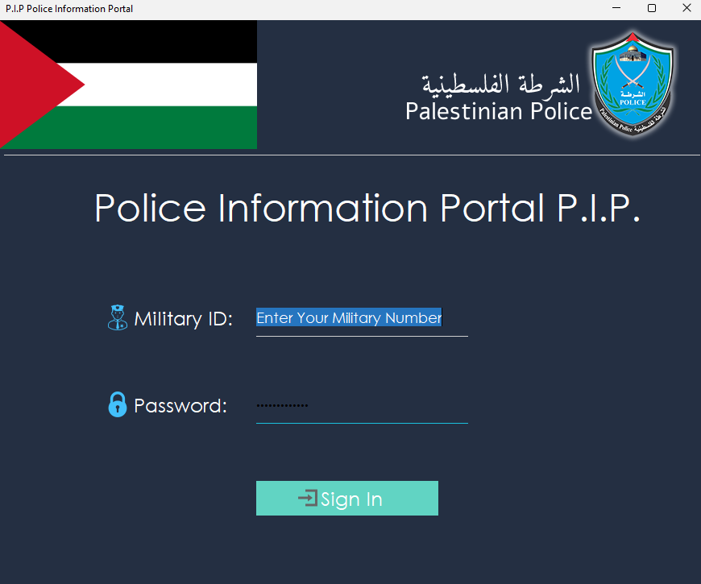
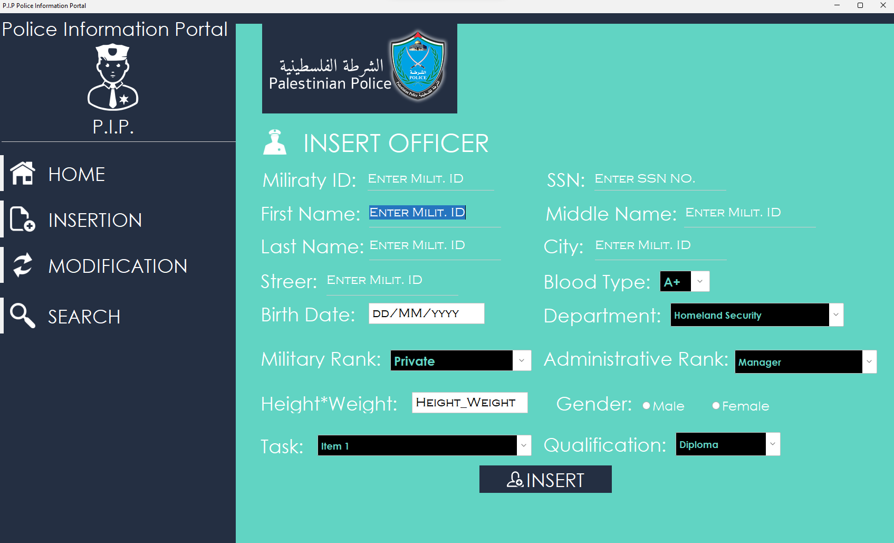

# DatabaseSystems-PPIP
<pre>
Palestinian Police Information Portal - PPIP
This Desktop Application was Built under the coursework of the DataBase Systems; over 4000 Lines of Code.
  FILE NAME : PIP_Application.java
  PIPP is an application for handling and arranging Officers information.
  DataBase: Oracle MySQL.
  Used Language: JAVA (IDE NetBeans 8.2).
</pre>

